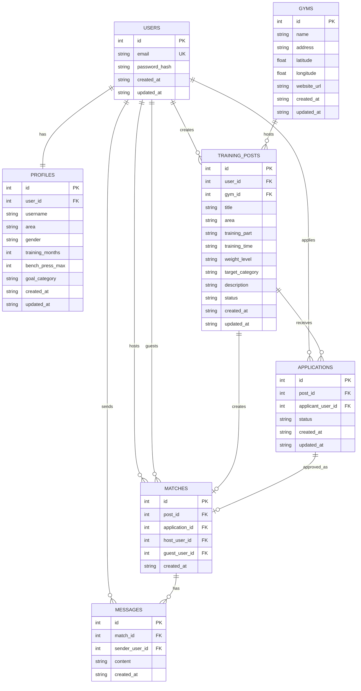

# DB設計

## 1. 前提

本ドキュメントは、`docs/requirements/requirements.md` の要件を元に、筋トレ合トレマッチングアプリで必要になるエンティティとER図を整理する。

初期開発では、以下のMVPを満たすことを目的とする。

- ユーザー登録・ログイン
- プロフィール登録・編集
- 合トレ募集の作成・閲覧
- 募集への応募
- マッチ成立
- マッチ後のチャット
- ジム情報の参照

## 2. エンティティ一覧

| エンティティ | テーブル名 | 概要 |
| --- | --- | --- |
| User | users | アプリを利用するユーザーの認証情報を管理する |
| Profile | profiles | ユーザー名、活動エリア、筋トレ歴、MAX重量などのプロフィール情報を管理する |
| TrainingPost | training_posts | 合トレ募集の内容を管理する |
| Application | applications | 合トレ募集への応募情報を管理する |
| Match | matches | 応募承認などによって成立したマッチ情報を管理する |
| Message | messages | マッチ成立後のチャットメッセージを管理する |
| Gym | gyms | ジム名、住所、位置情報、公式サイトURLなどを管理する |

## 3. 拡張候補エンティティ

初期MVPでは必須ではないが、要件の拡張として将来的に追加を検討する。

| エンティティ | テーブル名 | 概要 |
| --- | --- | --- |
| Review | reviews | 合トレ後の評価を管理する |
| Like | likes | 相互いいねによるマッチングを管理する |
| Notification | notifications | 応募、承認、メッセージなどの通知を管理する |
| TemplateMessage | template_messages | 初対面向けの定型文を管理する |

## 4. エンティティ間の関係

- UserはProfileを1つ持つ
- UserはTrainingPostを複数作成できる
- TrainingPostにはApplicationが複数紐づく
- UserはApplicationを複数作成できる
- Applicationが承認されるとMatchが作成される
- MatchにはMessageが複数紐づく
- UserはMessageを複数送信できる
- GymにはTrainingPostが複数紐づく

## 5. ER図

## 6. テーブル概要

### 6.1 users

ユーザーの認証情報を管理する。プロフィール情報とは分離し、ログインに必要な情報のみを持つ。

| カラム | 型 | 説明 |
| --- | --- | --- |
| id | bigint | ユーザーID |
| email | varchar | メールアドレス |
| password_hash | varchar | ハッシュ化済みパスワード |
| created_at | datetime | 作成日時 |
| updated_at | datetime | 更新日時 |

### 6.2 profiles

マッチング時に参照するユーザーの属性・筋トレ情報を管理する。

| カラム | 型 | 説明 |
| --- | --- | --- |
| id | bigint | プロフィールID |
| user_id | bigint | users.id |
| username | varchar | ユーザー名 |
| area | varchar | 主な活動エリア |
| gender | varchar | 性別 |
| training_months | int | 筋トレ歴を月単位で管理 |
| bench_press_max | int | ベンチプレス等のMAX重量 |
| goal_category | varchar | 大会勢、ダイエット、健康維持など |
| created_at | datetime | 作成日時 |
| updated_at | datetime | 更新日時 |

### 6.3 training_posts

合トレ募集を管理する。

| カラム | 型 | 説明 |
| --- | --- | --- |
| id | bigint | 募集ID |
| user_id | bigint | 募集作成者のusers.id |
| gym_id | bigint | gyms.id |
| title | varchar | 募集タイトル |
| area | varchar | 募集エリア |
| training_part | varchar | 胸、背中、脚など |
| training_time | datetime | トレーニング予定日時 |
| weight_level | varchar | 重量帯 |
| target_category | varchar | 目指すカテゴリ |
| description | text | 募集詳細 |
| status | varchar | open, matched, closedなど |
| created_at | datetime | 作成日時 |
| updated_at | datetime | 更新日時 |

### 6.4 applications

募集への応募を管理する。

| カラム | 型 | 説明 |
| --- | --- | --- |
| id | bigint | 応募ID |
| post_id | bigint | training_posts.id |
| applicant_user_id | bigint | 応募者のusers.id |
| status | varchar | pending, accepted, rejected, canceledなど |
| created_at | datetime | 作成日時 |
| updated_at | datetime | 更新日時 |

### 6.5 matches

合トレのマッチ成立情報を管理する。

| カラム | 型 | 説明 |
| --- | --- | --- |
| id | bigint | マッチID |
| post_id | bigint | training_posts.id |
| application_id | bigint | applications.id |
| host_user_id | bigint | 募集作成者のusers.id |
| guest_user_id | bigint | 応募者のusers.id |
| created_at | datetime | 作成日時 |

### 6.6 messages

マッチ成立後のチャットを管理する。

| カラム | 型 | 説明 |
| --- | --- | --- |
| id | bigint | メッセージID |
| match_id | bigint | matches.id |
| sender_user_id | bigint | 送信者のusers.id |
| content | text | メッセージ本文 |
| created_at | datetime | 作成日時 |

### 6.7 gyms

ジム情報を管理する。

| カラム | 型 | 説明 |
| --- | --- | --- |
| id | bigint | ジムID |
| name | varchar | ジム名 |
| address | varchar | 住所 |
| latitude | decimal | 緯度 |
| longitude | decimal | 経度 |
| website_url | varchar | 公式サイトURL |
| created_at | datetime | 作成日時 |
| updated_at | datetime | 更新日時 |
