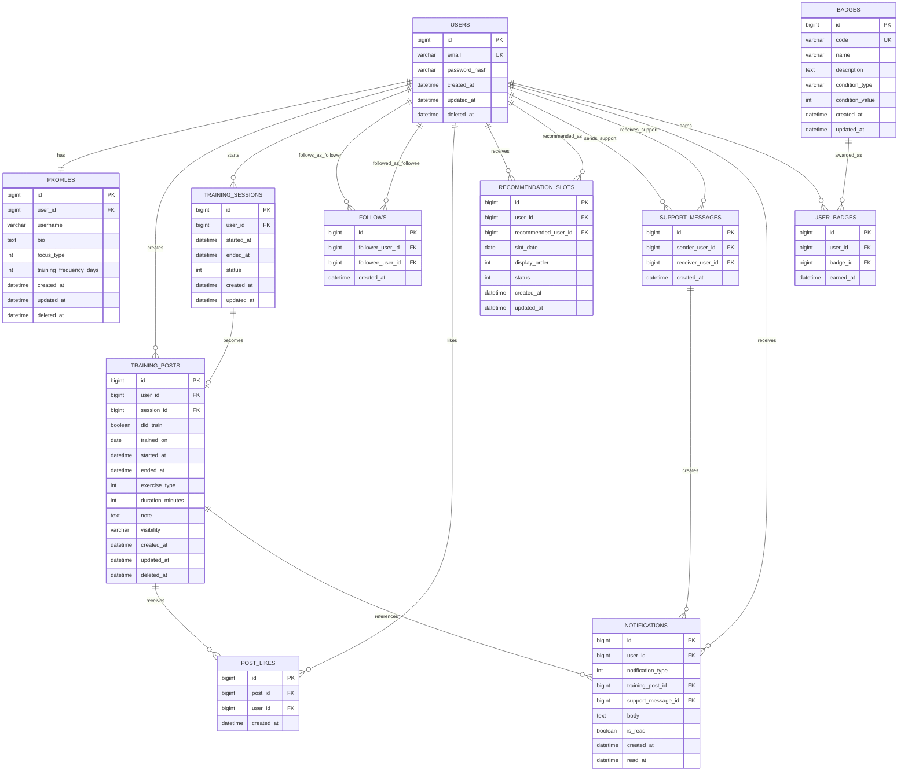

# データベース設計書

## 1. 設計方針

本ドキュメントは、`docs/requirements/requirements.md` の要件を元に、筋トレ投稿アプリで必要になるデータ構造を整理する。
初期開発では、以下のMVPを満たすことを目的とする。

- ユーザー登録・ログイン
- プロフィール登録・編集
- トレーニング報告投稿の作成・閲覧
- クイックスタートによる開始・終了記録
- フォロー、TL表示、いいね
- 自分とフォロー先のログ表示
- 推薦ユーザー表示
- プロフィールに設定したトレーニング頻度に基づくサボり判定と応援通知

### 1.1 命名規則

- テーブル名は複数形のスネークケースとする。例: `training_posts`
- カラム名はスネークケースとする。例: `created_at`
- 主キーは各テーブル共通で `id` とする。
- 外部キーは参照先テーブルの単数形に `_id` を付ける。例: `user_id`
- 真偽値は `is_`、`has_`、`did_` で始める。例: `is_read`、`did_train`
- ステータスや種別は `int` のIDとして管理し、IDに対応する表示値はバックエンドで変換する。
  - 例: `profiles.focus_type = 1` を「大会勢」として扱う。
  - 例: `training_sessions.status = 1` を「進行中」として扱う。

### 1.2 共通カラム

原則として、主要テーブルには以下の共通カラムを持たせる。

| カラム名   | 型                | 説明         |
| ---------- | ----------------- | ------------ |
| id         | bigint            | 主キー       |
| created_at | datetime          | 作成日時     |
| updated_at | datetime          | 更新日時     |
| deleted_at | datetime nullable | 論理削除日時 |

中間テーブルや履歴テーブルでは、用途に応じて `updated_at` または `deleted_at` を省略できる。

### 1.3 インデックス方針

- ログインで利用する `users.email` は一意インデックスを付与する。
- TL、ログ、カレンダー表示で利用する `training_posts.user_id`、`training_posts.trained_on`、`training_posts.created_at` にインデックスを付与する。
- フォロー関係は `follows.follower_user_id` と `follows.followee_user_id` の組み合わせを一意にする。
- いいねは `post_likes.post_id` と `post_likes.user_id` の組み合わせを一意にする。
- 推薦枠は `recommendation_slots.user_id`、`recommendation_slots.recommended_user_id`、`recommendation_slots.slot_date` を検索しやすくする。
- 通知は `notifications.user_id` と `notifications.created_at` で取得できるようにする。

### 1.4 論理削除 vs 物理削除

- ユーザー、プロフィール、投稿は復旧や監査の可能性があるため論理削除を基本とする。
- フォロー、いいね、推薦枠など再作成可能な関係データは物理削除を許容する。
- 通知は一定期間経過後の物理削除を許容する。
- 論理削除済みデータは、通常の一覧、TL、ログ、推薦対象から除外する。

## 2. ER図

## 3. テーブル定義

### 3.1 users

認証情報を管理する。プロフィール情報とは分離する。

| カラム名      | 型           | NULL | PK  | FK  | デフォルト        | 説明                     |
| ------------- | ------------ | ---- | --- | --- | ----------------- | ------------------------ |
| id            | bigint       | NO   | YES |     | auto increment    | ユーザーID               |
| email         | varchar(255) | NO   |     |     |                   | メールアドレス           |
| password_hash | varchar(255) | NO   |     |     |                   | ハッシュ化済みパスワード |
| created_at    | datetime     | NO   |     |     | current timestamp | 作成日時                 |
| updated_at    | datetime     | NO   |     |     | current timestamp | 更新日時                 |
| deleted_at    | datetime     | YES  |     |     | NULL              | 論理削除日時             |

#### インデックス

| インデックス名 | カラム | 種別   | 目的                     |
| -------------- | ------ | ------ | ------------------------ |
| uk_users_email | email  | unique | ログイン、メール重複防止 |

### 3.2 profiles

ユーザーの表示情報、推薦条件、トレーニング頻度を管理する。

| カラム名                | 型          | NULL | PK  | FK       | デフォルト        | 説明                                                     |
| ----------------------- | ----------- | ---- | --- | -------- | ----------------- | -------------------------------------------------------- |
| id                      | bigint      | NO   | YES |          | auto increment    | プロフィールID                                           |
| user_id                 | bigint      | NO   |     | users.id |                   | ユーザーID                                               |
| username                | varchar(80) | NO   |     |          |                   | 表示名                                                   |
| bio                     | text        | YES  |     |          | NULL              | 自己紹介                                                 |
| focus_type              | int         | YES  |     |          | NULL              | 重視項目ID。例: 1=大会勢、2=健康維持、3=ダイエットなど |
| training_frequency_days | int         | NO   |     |          | 3                 | 何日ごとにトレーニングする想定か                         |
| created_at              | datetime    | NO   |     |          | current timestamp | 作成日時                                                 |
| updated_at              | datetime    | NO   |     |          | current timestamp | 更新日時                                                 |
| deleted_at              | datetime    | YES  |     |          | NULL              | 論理削除日時                                             |

#### インデックス

| インデックス名          | カラム     | 種別   | 目的                             |
| ----------------------- | ---------- | ------ | -------------------------------- |
| uk_profiles_user_id     | user_id    | unique | ユーザーとプロフィールの1対1制約 |
| idx_profiles_focus_type | focus_type | normal | 推薦ユーザー抽出                 |

### 3.3 training_sessions

クイックスタートによる開始・終了記録を管理する。

| カラム名   | 型       | NULL | PK  | FK       | デフォルト        | 説明                                                     |
| ---------- | -------- | ---- | --- | -------- | ----------------- | -------------------------------------------------------- |
| id         | bigint   | NO   | YES |          | auto increment    | セッションID                                             |
| user_id    | bigint   | NO   |     | users.id |                   | ユーザーID                                               |
| started_at | datetime | NO   |     |          |                   | 開始日時                                                 |
| ended_at   | datetime | YES  |     |          | NULL              | 終了日時                                                 |
| status     | int      | NO   |     |          | 1                 | セッション状態ID。例: 1=進行中、2=完了、3=キャンセル |
| created_at | datetime | NO   |     |          | current timestamp | 作成日時                                                 |
| updated_at | datetime | NO   |     |          | current timestamp | 更新日時                                                 |

#### インデックス

| インデックス名                    | カラム          | 種別   | 目的                           |
| --------------------------------- | --------------- | ------ | ------------------------------ |
| idx_training_sessions_user_status | user_id, status | normal | ユーザーの進行中セッション取得 |
| idx_training_sessions_started_at  | started_at      | normal | 履歴検索                       |

### 3.4 training_posts

トレーニング報告投稿を管理する。クイックスタート由来、事後報告由来の両方を扱う。

| カラム名         | 型           | NULL | PK  | FK                   | デフォルト                | 説明                                              |
| ---------------- | ------------ | ---- | --- | -------------------- | ------------------------- | ------------------------------------------------- |
| id               | bigint       | NO   | YES |                      | auto increment            | 投稿ID                                            |
| user_id          | bigint       | NO   |     | users.id             |                           | 投稿者ユーザーID                                  |
| session_id       | bigint       | YES  |     | training_sessions.id | NULL                      | クイックスタート記録ID                            |
| did_train        | boolean      | NO   |     |                      | true                      | トレーニング実施有無                              |
| trained_on       | date         | NO   |     |                      |                           | トレーニング日                                    |
| started_at       | datetime     | YES  |     |                      | NULL                      | 開始日時                                          |
| ended_at         | datetime     | YES  |     |                      | NULL                      | 終了日時                                          |
| exercise_type    | int          | YES  |     |                      | NULL                      | 種目・部位ID。例: 1=胸、2=背中、3=脚など          |
| duration_minutes | int          | YES  |     |                      | NULL                      | トレーニング時間                                  |
| note             | text         | YES  |     |                      | NULL                      | 自由記述、感想                                    |
| visibility       | varchar(30)  | NO   |     |                      | followers_and_recommended | followers, recommended, followers_and_recommended |
| created_at       | datetime     | NO   |     |                      | current timestamp         | 作成日時                                          |
| updated_at       | datetime     | NO   |     |                      | current timestamp         | 更新日時                                          |
| deleted_at       | datetime     | YES  |     |                      | NULL                      | 論理削除日時                                      |

#### インデックス

| インデックス名                     | カラム              | 種別   | 目的                                         |
| ---------------------------------- | ------------------- | ------ | -------------------------------------------- |
| idx_training_posts_user_created    | user_id, created_at | normal | 自分・フォロー先ログの新着順取得             |
| idx_training_posts_user_trained_on | user_id, trained_on | normal | カレンダー表示                               |
| idx_training_posts_created_at      | created_at          | normal | TL新着順取得                                 |
| uk_training_posts_session_id       | session_id          | unique | 1つのセッションから作成できる投稿を1件に制限 |

### 3.5 follows

フォロー関係を管理する。

| カラム名         | 型       | NULL | PK  | FK       | デフォルト        | 説明                     |
| ---------------- | -------- | ---- | --- | -------- | ----------------- | ------------------------ |
| id               | bigint   | NO   | YES |          | auto increment    | フォローID               |
| follower_user_id | bigint   | NO   |     | users.id |                   | フォローするユーザーID   |
| followee_user_id | bigint   | NO   |     | users.id |                   | フォローされるユーザーID |
| created_at       | datetime | NO   |     |          | current timestamp | 作成日時                 |

#### インデックス

| インデックス名       | カラム                             | 種別   | 目的               |
| -------------------- | ---------------------------------- | ------ | ------------------ |
| uk_follows_pair      | follower_user_id, followee_user_id | unique | 重複フォロー防止   |
| idx_follows_followee | followee_user_id                   | normal | フォロワー一覧取得 |

### 3.6 post_likes

投稿へのいいねを管理する。

| カラム名   | 型       | NULL | PK  | FK                | デフォルト        | 説明                 |
| ---------- | -------- | ---- | --- | ----------------- | ----------------- | -------------------- |
| id         | bigint   | NO   | YES |                   | auto increment    | いいねID             |
| post_id    | bigint   | NO   |     | training_posts.id |                   | 投稿ID               |
| user_id    | bigint   | NO   |     | users.id          |                   | いいねしたユーザーID |
| created_at | datetime | NO   |     |                   | current timestamp | 作成日時             |

#### インデックス

| インデックス名      | カラム           | 種別   | 目的                       |
| ------------------- | ---------------- | ------ | -------------------------- |
| uk_post_likes_pair  | post_id, user_id | unique | 同一投稿への重複いいね防止 |
| idx_post_likes_user | user_id          | normal | ユーザー別いいね履歴       |

### 3.7 recommendation_slots

日替わり推薦ユーザー枠を管理する。
表示中の推薦ユーザーは全員フォロー可能であり、推薦枠からのフォロー人数に1日あたりの上限は設けない。

| カラム名            | 型          | NULL | PK  | FK       | デフォルト        | 説明                      |
| ------------------- | ----------- | ---- | --- | -------- | ----------------- | ------------------------- |
| id                  | bigint      | NO   | YES |          | auto increment    | 推薦枠ID                  |
| user_id             | bigint      | NO   |     | users.id |                   | 推薦を受けるユーザーID    |
| recommended_user_id | bigint      | NO   |     | users.id |                   | 推薦されるユーザーID      |
| slot_date           | date        | NO   |     |          |                   | 推薦枠の日付              |
| display_order       | int         | NO   |     |          | 0                 | 表示順                    |
| status              | int         | NO   |     |          | 1                 | 推薦枠状態ID。例: 1=有効、2=フォロー済み、3=期限切れ |
| created_at          | datetime    | NO   |     |          | current timestamp | 作成日時                  |
| updated_at          | datetime    | NO   |     |          | current timestamp | 更新日時                  |

#### インデックス

| インデックス名                     | カラム                                  | 種別   | 目的               |
| ---------------------------------- | --------------------------------------- | ------ | ------------------ |
| uk_recommendation_slots_pair       | user_id, recommended_user_id, slot_date | unique | 同日の重複推薦防止 |
| idx_recommendation_slots_user_date | user_id, slot_date                      | normal | 当日推薦枠取得     |
| idx_recommendation_slots_status    | status                                  | normal | 入れ替え対象抽出   |

### 3.8 support_messages

サボり状態のユーザーに対して、フォロワーが「がんばれボタン」を押した記録を管理する。
応援文面は持たず、受信者には応援通知のみを送る。
サボり状態は、対象ユーザーの最新トレーニング実施日から `profiles.training_frequency_days` を超えてトレーニングがない状態として判定する。
サボり状態のユーザーがいる場合、そのフォロワーにモーダルを表示し、フォロワーが「がんばれボタン」を押すと本テーブルに記録し、`notifications` に応援通知を作成する。

| カラム名         | 型       | NULL | PK  | FK       | デフォルト        | 説明         |
| ---------------- | -------- | ---- | --- | -------- | ----------------- | ------------ |
| id               | bigint   | NO   | YES |          | auto increment    | 応援ID       |
| sender_user_id   | bigint   | NO   |     | users.id |                   | 応援送信者ID |
| receiver_user_id | bigint   | NO   |     | users.id |                   | 応援受信者ID |
| created_at       | datetime | NO   |     |          | current timestamp | 作成日時     |

#### インデックス

| インデックス名                        | カラム                       | 種別   | 目的                 |
| ------------------------------------- | ---------------------------- | ------ | -------------------- |
| idx_support_messages_receiver_created | receiver_user_id, created_at | normal | 受信した応援履歴取得 |
| idx_support_messages_sender_created   | sender_user_id, created_at   | normal | 送信した応援履歴取得 |

### 3.9 notifications

ユーザーへの通知を管理する。

| カラム名           | 型       | NULL | PK  | FK                  | デフォルト        | 説明                                      |
| ------------------ | -------- | ---- | --- | ------------------- | ----------------- | ----------------------------------------- |
| id                 | bigint   | NO   | YES |                     | auto increment    | 通知ID                                    |
| user_id            | bigint   | NO   |     | users.id            |                   | 通知受信ユーザーID                        |
| notification_type  | int      | NO   |     |                     |                   | 通知種別ID。例: 1=いいね、2=応援、3=サボり検知 |
| training_post_id   | bigint   | YES  |     | training_posts.id   | NULL              | 関連投稿ID                                |
| support_message_id | bigint   | YES  |     | support_messages.id | NULL              | 関連応援ID                                |
| body               | text     | NO   |     |                     |                   | 通知本文                                  |
| is_read            | boolean  | NO   |     |                     | false             | 既読状態                                  |
| created_at         | datetime | NO   |     |                     | current timestamp | 作成日時                                  |
| read_at            | datetime | YES  |     |                     | NULL              | 既読日時                                  |

#### インデックス

| インデックス名                 | カラム              | 種別   | 目的         |
| ------------------------------ | ------------------- | ------ | ------------ |
| idx_notifications_user_created | user_id, created_at | normal | 通知一覧取得 |
| idx_notifications_user_read    | user_id, is_read    | normal | 未読通知取得 |

### 3.10 badges

バッジのマスタ情報を管理する。

| カラム名        | 型           | NULL | PK  | FK  | デフォルト        | 説明                                   |
| --------------- | ------------ | ---- | --- | --- | ----------------- | -------------------------------------- |
| id              | bigint       | NO   | YES |     | auto increment    | バッジID                               |
| code            | varchar(80)  | NO   |     |     |                   | バッジコード                           |
| name            | varchar(100) | NO   |     |     |                   | バッジ名                               |
| description     | text         | YES  |     |     | NULL              | 説明                                   |
| condition_type  | varchar(50)  | NO   |     |     |                   | post_count, streak_days, comeback など |
| condition_value | int          | NO   |     |     | 0                 | 達成条件値                             |
| created_at      | datetime     | NO   |     |     | current timestamp | 作成日時                               |
| updated_at      | datetime     | NO   |     |     | current timestamp | 更新日時                               |

#### インデックス

| インデックス名 | カラム | 種別   | 目的                 |
| -------------- | ------ | ------ | -------------------- |
| uk_badges_code | code   | unique | バッジコード重複防止 |

### 3.11 user_badges

ユーザーが獲得したバッジを管理する。

| カラム名  | 型       | NULL | PK  | FK        | デフォルト        | 説明             |
| --------- | -------- | ---- | --- | --------- | ----------------- | ---------------- |
| id        | bigint   | NO   | YES |           | auto increment    | ユーザーバッジID |
| user_id   | bigint   | NO   |     | users.id  |                   | ユーザーID       |
| badge_id  | bigint   | NO   |     | badges.id |                   | バッジID         |
| earned_at | datetime | NO   |     |           | current timestamp | 獲得日時         |

#### インデックス

| インデックス名       | カラム            | 種別   | 目的                     |
| -------------------- | ----------------- | ------ | ------------------------ |
| uk_user_badges_pair  | user_id, badge_id | unique | 同一バッジの重複獲得防止 |
| idx_user_badges_user | user_id           | normal | プロフィールのバッジ表示 |

## 4. リレーション定義

| 親テーブル        | 子テーブル           | 関係   | FK                                       | 説明                                     |
| ----------------- | -------------------- | ------ | ---------------------------------------- | ---------------------------------------- |
| users             | profiles             | 1:1    | profiles.user_id                         | ユーザーはプロフィールを1つ持つ          |
| users             | training_sessions    | 1:N    | training_sessions.user_id                | ユーザーはクイックスタート記録を複数持つ |
| users             | training_posts       | 1:N    | training_posts.user_id                   | ユーザーは投稿を複数作成できる           |
| training_sessions | training_posts       | 1:0..1 | training_posts.session_id                | セッションは投稿に変換される場合がある   |
| users             | follows              | 1:N    | follows.follower_user_id                 | ユーザーは複数ユーザーをフォローできる   |
| users             | follows              | 1:N    | follows.followee_user_id                 | ユーザーは複数ユーザーからフォローされる |
| training_posts    | post_likes           | 1:N    | post_likes.post_id                       | 投稿は複数のいいねを受け取る             |
| users             | post_likes           | 1:N    | post_likes.user_id                       | ユーザーは複数投稿にいいねできる         |
| users             | recommendation_slots | 1:N    | recommendation_slots.user_id             | ユーザーは日替わり推薦枠を持つ           |
| users             | recommendation_slots | 1:N    | recommendation_slots.recommended_user_id | ユーザーは他ユーザーに推薦される         |
| users             | support_messages     | 1:N    | support_messages.sender_user_id          | ユーザーは応援を送信できる               |
| users             | support_messages     | 1:N    | support_messages.receiver_user_id        | ユーザーは応援を受信できる               |
| users             | notifications        | 1:N    | notifications.user_id                    | ユーザーは通知を複数受け取る             |
| training_posts    | notifications        | 1:N    | notifications.training_post_id           | 投稿に関連する通知を作成できる           |
| support_messages  | notifications        | 1:N    | notifications.support_message_id         | 応援に関連する通知を作成できる           |
| badges            | user_badges          | 1:N    | user_badges.badge_id                     | バッジは複数ユーザーに付与される         |
| users             | user_badges          | 1:N    | user_badges.user_id                      | ユーザーは複数バッジを獲得できる         |

## 5. マイグレーション計画

| #   | 内容                        | 依存                                          | 備考                                   |
| --- | --------------------------- | --------------------------------------------- | -------------------------------------- |
| 001 | `users` 作成                | なし                                          | 認証基盤                               |
| 002 | `profiles` 作成             | `users`                                       | プロフィール、重視項目、トレーニング頻度 |
| 003 | `training_sessions` 作成    | `users`                                       | クイックスタート                       |
| 004 | `training_posts` 作成       | `users`, `training_sessions`                  | 事後報告、投稿詳細、ログ、カレンダー   |
| 005 | `follows` 作成              | `users`                                       | フォロー、TL                           |
| 006 | `post_likes` 作成           | `users`, `training_posts`                     | いいね                                 |
| 007 | `recommendation_slots` 作成 | `users`                                       | 日替わり推薦ユーザー                   |
| 008 | `support_messages` 作成     | `users`                                       | がんばれボタン押下記録                 |
| 009 | `notifications` 作成        | `users`, `training_posts`, `support_messages` | 通知一覧                               |
| 010 | `badges` 作成               | なし                                          | バッジマスタ                           |
| 011 | `user_badges` 作成          | `users`, `badges`                             | ユーザー獲得バッジ                     |
