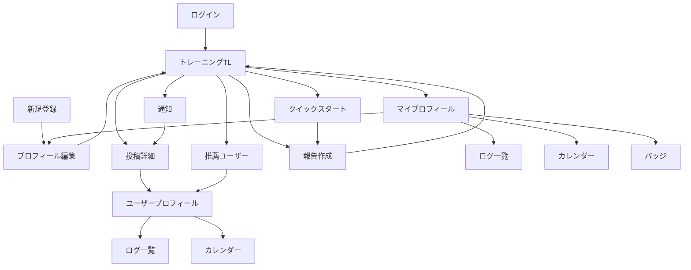

# 画面設計書

## 1. 画面一覧

| # | 画面名 | URL | 認証 | ロール | 説明 |
|---|---|---|---|---|---|
| 1 | ログイン | `/login` | 不要 | 未ログインユーザー | メールアドレスとパスワードでログインする |
| 2 | 新規登録 | `/signup` | 不要 | 未ログインユーザー | アカウントを作成する |
| 3 | トレーニングTL | `/timeline` | 必要 | ユーザー | フォロー先と推薦ユーザーの投稿サマリーを見る |
| 4 | 投稿詳細 | `/posts/:postId` | 必要 | ユーザー | 投稿の詳細内容を確認し、いいねする |
| 5 | クイックスタート | `/sessions/active` | 必要 | ユーザー | トレーニング開始・終了を記録する |
| 6 | 報告作成 | `/posts/new` | 必要 | ユーザー | 事後報告またはクイックスタート終了後の報告を作成する |
| 7 | マイプロフィール | `/me` | 必要 | ユーザー | 自分のプロフィール、ログ、バッジ導線を表示する |
| 8 | プロフィール編集 | `/me/edit` | 必要 | ユーザー | 表示名、自己紹介、重視項目、トレーニング頻度を編集する |
| 9 | ユーザープロフィール | `/users/:userId` | 必要 | ユーザー | 他ユーザーのプロフィールを表示し、フォロー操作を行う |
| 10 | ログ一覧 | `/users/:userId/logs` | 必要 | ユーザー | 対象ユーザーの投稿履歴を新しい順で見る |
| 11 | カレンダー | `/users/:userId/calendar` | 必要 | ユーザー | 投稿日・トレーニング実施日を月単位で確認する |
| 12 | 推薦ユーザー | `/recommendations` | 必要 | ユーザー | 日替わり推薦ユーザー最大5人を確認し、フォローする |
| 13 | 通知 | `/notifications` | 必要 | ユーザー | いいね、応援などの通知を確認する |
| 14 | バッジ | `/me/badges` | 必要 | ユーザー | 自分の獲得バッジを確認する |

## 2. 画面遷移図



## 3. 画面詳細

### 3.1 トレーニングTL

#### 概要

ログイン後のメイン画面。フォロー先と推薦ユーザーの投稿サマリーを新しい順で表示する。画面下部には主要導線としてTL、報告作成、クイックスタート、プロフィールを配置する。

#### ワイヤーフレーム

```text
┌────────────────────┐
│ TL        通知アイコン │
├────────────────────┤
│ 応援モーダル          │  サボり状態のフォロー先がいる場合のみ表示
│ ○○さんにがんばれ     │
│ [がんばれ] [閉じる]   │
├────────────────────┤
│ 推薦ユーザー横スクロール │
│ [A] [B] [C] [D] [E] │
├────────────────────┤
│ 投稿カード             │
│ ユーザー名 / 日付       │
│ やった・種目・時間      │
│ 本文プレビュー          │
│ ♡ 12                  │
├────────────────────┤
│ BottomNav             │
└────────────────────┘
```

#### 表示項目

| # | 項目名 | 型 | 必須 | 説明 |
|---|---|---|---|---|
| 1 | 投稿者名 | string | 必須 | 投稿者の表示名 |
| 2 | 投稿者アイコン | image/url | 任意 | 未設定時はデフォルト表示 |
| 3 | トレーニング日 | date | 必須 | 投稿対象の日付 |
| 4 | 実施有無 | boolean | 必須 | やった / やっていない |
| 5 | 種目・部位 | int label | 任意 | `exercise_type` の表示値 |
| 6 | 時間 | number | 任意 | `duration_minutes` |
| 7 | 本文プレビュー | string | 任意 | `note` の先頭部分 |
| 8 | いいね数 | number | 必須 | 投稿へのいいね数 |
| 9 | 推薦ユーザー | list | 任意 | 最大5人 |
| 10 | 応援モーダル | modal | 任意 | サボり状態のフォロー先がいる場合に表示 |

#### アクション

| # | アクション | トリガー | 処理内容 | API |
|---|---|---|---|---|
| 1 | TL取得 | 初期表示、スクロール | 投稿サマリーを取得する | `GET /api/timeline` |
| 2 | 投稿詳細へ遷移 | 投稿カードタップ | 投稿詳細画面へ遷移する | - |
| 3 | いいね | いいねボタン | いいね作成または解除 | `POST /api/posts/{postId}/like`, `DELETE /api/posts/{postId}/like` |
| 4 | 推薦ユーザー表示 | 初期表示 | 推薦ユーザーを取得する | `GET /api/recommendations` |
| 5 | 推薦ユーザーをフォロー | フォローボタン | 対象ユーザーをフォローする | `POST /api/users/{userId}/follow` |
| 6 | 応援送信 | がんばれボタン | 応援記録と通知を作成する | `POST /api/supports` |

#### バリデーション

- 未ログインの場合はログイン画面へ遷移する。
- 自分自身へのフォロー操作は表示しない。
- 既にフォロー済みの推薦ユーザーはフォロー済み状態で表示する。

#### エラー表示

- TL取得失敗時は再読み込みボタンを表示する。
- いいね、フォロー、応援の失敗時はトーストでエラーを表示する。

#### レスポンシブ対応

- モバイルでは1カラム表示とする。
- タブレット以上では本文幅を最大640pxに制限し、中央寄せで表示する。

### 3.2 投稿詳細

#### 概要

投稿サマリーから遷移し、報告内容の詳細を表示する。

#### ワイヤーフレーム

```text
┌────────────────────┐
│ ← 投稿詳細           │
├────────────────────┤
│ 投稿者情報            │
│ トレーニング日         │
│ 開始 / 終了            │
│ やった / やっていない  │
│ 種目・時間             │
│ 自由記述               │
│ ♡ いいね              │
└────────────────────┘
```

#### 表示項目

| # | 項目名 | 型 | 必須 | 説明 |
|---|---|---|---|---|
| 1 | 投稿者情報 | object | 必須 | ユーザー名、アイコン、プロフィール導線 |
| 2 | トレーニング日 | date | 必須 | `trained_on` |
| 3 | 開始日時 | datetime | 任意 | クイックスタート由来の場合に表示 |
| 4 | 終了日時 | datetime | 任意 | クイックスタート由来の場合に表示 |
| 5 | 実施有無 | boolean | 必須 | やった / やっていない |
| 6 | 種目・部位 | int label | 任意 | `exercise_type` の表示値 |
| 7 | 時間 | number | 任意 | 分単位 |
| 8 | 自由記述 | text | 任意 | 感想や詳細 |
| 9 | いいね状態 | boolean | 必須 | 自分がいいね済みか |

#### アクション

| # | アクション | トリガー | 処理内容 | API |
|---|---|---|---|---|
| 1 | 投稿詳細取得 | 初期表示 | 投稿詳細を取得する | `GET /api/posts/{postId}` |
| 2 | いいね切替 | いいねボタン | いいね作成または解除 | `POST /api/posts/{postId}/like`, `DELETE /api/posts/{postId}/like` |
| 3 | プロフィール遷移 | 投稿者タップ | ユーザープロフィールへ遷移 | - |

#### バリデーション

- 閲覧権限がない投稿は表示しない。

#### エラー表示

- 404の場合は「投稿が見つかりません」を表示する。
- 403の場合は「この投稿は閲覧できません」を表示する。

#### レスポンシブ対応

- モバイルは縦積み、PCは中央寄せの1カラム。

### 3.3 クイックスタート

#### 概要

トレーニングの開始・終了を素早く記録する。終了後は報告作成画面へ遷移する。

#### ワイヤーフレーム

```text
┌────────────────────┐
│ クイックスタート      │
├────────────────────┤
│ 00:42:10             │
│ 開始日時              │
│ [終了して報告へ]       │
│ [キャンセル]           │
└────────────────────┘
```

#### 表示項目

| # | 項目名 | 型 | 必須 | 説明 |
|---|---|---|---|---|
| 1 | 経過時間 | duration | 必須 | 開始からの経過時間 |
| 2 | 開始日時 | datetime | 必須 | `started_at` |
| 3 | セッション状態 | int label | 必須 | 進行中、完了、キャンセル |

#### アクション

| # | アクション | トリガー | 処理内容 | API |
|---|---|---|---|---|
| 1 | 開始 | クイックスタートボタン | セッションを作成する | `POST /api/training-sessions` |
| 2 | 進行中取得 | 初期表示 | 進行中セッションを取得する | `GET /api/training-sessions/active` |
| 3 | 終了 | 終了ボタン | 終了日時を記録する | `PUT /api/training-sessions/{sessionId}/finish` |
| 4 | キャンセル | キャンセルボタン | セッションをキャンセルする | `PUT /api/training-sessions/{sessionId}/cancel` |

#### バリデーション

- 同一ユーザーが同時に作成できる進行中セッションは1件までとする。

#### エラー表示

- 既に進行中セッションがある場合は既存セッション画面を表示する。

#### レスポンシブ対応

- 操作ボタンは親指で押しやすい画面下部に固定する。

### 3.4 報告作成

#### 概要

事後報告またはクイックスタート終了後の報告投稿を作成する。

#### ワイヤーフレーム

```text
┌────────────────────┐
│ 報告作成             │
├────────────────────┤
│ やった? [はい/いいえ] │
│ 日付                 │
│ 種目                 │
│ 時間                 │
│ 感想                 │
│ 公開範囲             │
│ [投稿する]            │
└────────────────────┘
```

#### 表示項目

| # | 項目名 | 型 | 必須 | 説明 |
|---|---|---|---|---|
| 1 | 実施有無 | boolean | 必須 | やった / やっていない |
| 2 | トレーニング日 | date | 必須 | 事後報告では手入力、セッション由来では初期値あり |
| 3 | 開始日時 | datetime | 任意 | セッション由来の場合 |
| 4 | 終了日時 | datetime | 任意 | セッション由来の場合 |
| 5 | 種目・部位 | int | 任意 | IDで保存し、表示値はバックエンドで変換 |
| 6 | 時間 | number | 任意 | 分単位 |
| 7 | 自由記述 | text | 任意 | 感想や詳細 |
| 8 | 公開範囲 | string | 必須 | followers, recommended, followers_and_recommended |

#### アクション

| # | アクション | トリガー | 処理内容 | API |
|---|---|---|---|---|
| 1 | 投稿作成 | 投稿するボタン | 報告投稿を作成する | `POST /api/posts` |
| 2 | 種目一覧取得 | 初期表示 | 種目IDと表示名を取得する | `GET /api/masters/exercise-types` |

#### バリデーション

- 実施有無は必須。
- トレーニング日は必須。
- 時間は0以上の整数。
- 自由記述は最大文字数を超えないこと。

#### エラー表示

- 必須項目の未入力は項目下に表示する。
- 投稿失敗時は画面上部にエラーバナーを表示する。

#### レスポンシブ対応

- モバイルでは入力項目を縦に並べ、送信ボタンを下部に固定する。

### 3.5 プロフィール

#### 概要

自分または他ユーザーのプロフィールを表示する。自分の場合は編集、ログ、バッジへの導線を表示する。他ユーザーの場合はフォロー操作とログ閲覧導線を表示する。

#### ワイヤーフレーム

```text
┌────────────────────┐
│ プロフィール          │
├────────────────────┤
│ アイコン / 名前        │
│ 自己紹介              │
│ 重視項目              │
│ トレーニング頻度       │
│ [編集] or [フォロー]   │
│ [ログ] [カレンダー]    │
│ [バッジ]              │
└────────────────────┘
```

#### 表示項目

| # | 項目名 | 型 | 必須 | 説明 |
|---|---|---|---|---|
| 1 | 表示名 | string | 必須 | `username` |
| 2 | 自己紹介 | text | 任意 | `bio` |
| 3 | 重視項目 | int label | 任意 | `focus_type` の表示値 |
| 4 | トレーニング頻度 | number | 必須 | `training_frequency_days` |
| 5 | フォロー状態 | boolean | 任意 | 他ユーザー表示時 |
| 6 | バッジ概要 | list | 任意 | 獲得済みバッジの一部 |

#### アクション

| # | アクション | トリガー | 処理内容 | API |
|---|---|---|---|---|
| 1 | 自分のプロフィール取得 | `/me` 初期表示 | 自分のプロフィール取得 | `GET /api/me` |
| 2 | 他人のプロフィール取得 | `/users/:userId` 初期表示 | 対象ユーザー情報取得 | `GET /api/users/{userId}` |
| 3 | フォロー | フォローボタン | フォロー作成 | `POST /api/users/{userId}/follow` |
| 4 | フォロー解除 | 解除ボタン | フォロー削除 | `DELETE /api/users/{userId}/follow` |

#### バリデーション

- 自分自身にはフォローボタンを表示しない。

#### エラー表示

- 対象ユーザーが存在しない場合は404画面を表示する。

#### レスポンシブ対応

- モバイルではプロフィール情報、アクション、ログ導線を縦に並べる。

### 3.6 プロフィール編集

#### 概要

自分のプロフィール情報を編集する。

#### ワイヤーフレーム

```text
┌────────────────────┐
│ プロフィール編集      │
├────────────────────┤
│ 表示名               │
│ 自己紹介             │
│ 重視項目             │
│ トレーニング頻度      │
│ [保存]               │
└────────────────────┘
```

#### 表示項目

| # | 項目名 | 型 | 必須 | 説明 |
|---|---|---|---|---|
| 1 | 表示名 | string | 必須 | 最大80文字 |
| 2 | 自己紹介 | text | 任意 | 最大500文字 |
| 3 | 重視項目 | int | 任意 | `focus_type` |
| 4 | トレーニング頻度 | number | 必須 | 何日ごとにトレーニングする想定か |

#### アクション

| # | アクション | トリガー | 処理内容 | API |
|---|---|---|---|---|
| 1 | 保存 | 保存ボタン | プロフィール更新 | `PUT /api/me/profile` |
| 2 | 重視項目取得 | 初期表示 | 重視項目IDと表示名を取得 | `GET /api/masters/focus-types` |

#### バリデーション

- 表示名は必須。
- トレーニング頻度は1以上の整数。

#### エラー表示

- 入力エラーは項目下に表示する。

#### レスポンシブ対応

- 保存ボタンは画面下部に固定する。

### 3.7 ログ一覧・カレンダー

#### 概要

対象ユーザーの投稿履歴を一覧またはカレンダーで確認する。

#### ワイヤーフレーム

```text
┌────────────────────┐
│ ログ [一覧][カレンダー]│
├────────────────────┤
│ 一覧: 投稿カード       │
│ または                │
│ カレンダー月表示       │
│ 実施日: 色付き         │
│ やっていない: 別色     │
└────────────────────┘
```

#### 表示項目

| # | 項目名 | 型 | 必須 | 説明 |
|---|---|---|---|---|
| 1 | 投稿一覧 | list | 任意 | 新しい順 |
| 2 | 対象年月 | year-month | 任意 | カレンダー表示時 |
| 3 | 実施日 | date list | 任意 | 色付き表示 |
| 4 | 未実施日 | date list | 任意 | 実施日と区別表示 |

#### アクション

| # | アクション | トリガー | 処理内容 | API |
|---|---|---|---|---|
| 1 | ログ取得 | 初期表示、スクロール | 投稿履歴取得 | `GET /api/users/{userId}/posts` |
| 2 | カレンダー取得 | 月切替 | 月ごとの実績取得 | `GET /api/users/{userId}/calendar` |
| 3 | 投稿詳細へ遷移 | 投稿または日付タップ | 投稿詳細へ遷移 | - |

#### バリデーション

- 閲覧権限がない対象ユーザーのログは表示しない。

#### エラー表示

- 権限がない場合は403メッセージを表示する。

#### レスポンシブ対応

- カレンダーはモバイル幅でも7列を維持し、セル内テキストは最小限にする。

### 3.8 推薦ユーザー

#### 概要

重視項目などを元に推薦された最大5人のユーザーを表示する。表示中の推薦ユーザーは全員フォローできる。

#### ワイヤーフレーム

```text
┌────────────────────┐
│ 推薦ユーザー          │
├────────────────────┤
│ ユーザーカード         │
│ 名前 / 重視項目        │
│ [プロフィール] [フォロー]│
└────────────────────┘
```

#### 表示項目

| # | 項目名 | 型 | 必須 | 説明 |
|---|---|---|---|---|
| 1 | 推薦ユーザー一覧 | list | 必須 | 最大5人 |
| 2 | 表示名 | string | 必須 | 推薦ユーザー名 |
| 3 | 重視項目 | int label | 任意 | 推薦理由として表示 |
| 4 | フォロー状態 | boolean | 必須 | フォロー済みか |

#### アクション

| # | アクション | トリガー | 処理内容 | API |
|---|---|---|---|---|
| 1 | 推薦取得 | 初期表示 | 推薦ユーザーを取得 | `GET /api/recommendations` |
| 2 | フォロー | フォローボタン | 推薦ユーザーをフォロー | `POST /api/users/{userId}/follow` |
| 3 | プロフィール表示 | プロフィールボタン | ユーザープロフィールへ遷移 | - |

#### バリデーション

- 表示されている推薦ユーザー全員をフォロー可能とし、1日あたりのフォロー上限は設けない。

#### エラー表示

- 推薦ユーザーがいない場合は空状態を表示する。

#### レスポンシブ対応

- モバイルは縦リスト、広幅では2カラムまで許容する。

### 3.9 通知

#### 概要

いいね、応援、サボり検知などの通知を表示する。

#### ワイヤーフレーム

```text
┌────────────────────┐
│ 通知                 │
├────────────────────┤
│ 未読通知              │
│ 通知本文 / 時刻        │
│ 既読通知              │
└────────────────────┘
```

#### 表示項目

| # | 項目名 | 型 | 必須 | 説明 |
|---|---|---|---|---|
| 1 | 通知種別 | int label | 必須 | いいね、応援、サボり検知 |
| 2 | 通知本文 | text | 必須 | 表示用本文 |
| 3 | 既読状態 | boolean | 必須 | `is_read` |
| 4 | 作成日時 | datetime | 必須 | 通知発生日時 |

#### アクション

| # | アクション | トリガー | 処理内容 | API |
|---|---|---|---|---|
| 1 | 通知取得 | 初期表示 | 通知一覧を取得 | `GET /api/notifications` |
| 2 | 既読化 | 通知タップ | 通知を既読にする | `PUT /api/notifications/{notificationId}/read` |
| 3 | 関連画面遷移 | 通知タップ | 投稿詳細などへ遷移 | - |

#### バリデーション

- 自分宛て以外の通知は取得できない。

#### エラー表示

- 通知取得失敗時は再読み込みボタンを表示する。

#### レスポンシブ対応

- モバイルは時系列リストで表示する。

## 4. 共通コンポーネント

| コンポーネント | 使用画面 | 説明 |
|---|---|---|
| BottomNav | TL、報告作成、プロフィール、通知 | モバイル下部の主要ナビゲーション |
| PostSummaryCard | TL、ログ一覧 | 投稿サマリーを表示するカード |
| UserCard | 推薦ユーザー、フォロー導線 | ユーザー名、重視項目、フォローボタンを表示 |
| LikeButton | TL、投稿詳細 | いいね作成・解除を行う |
| SupportModal | TL | サボり状態のフォロー先へ応援を送るモーダル |
| CalendarGrid | カレンダー | 月単位の日付と実績状態を表示 |
| ProfileHeader | プロフィール | ユーザー基本情報と主要アクションを表示 |
| FormError | 各入力画面 | 入力バリデーションエラーを項目単位で表示 |
| Toast | 全画面 | 成功・失敗の短いフィードバックを表示 |
